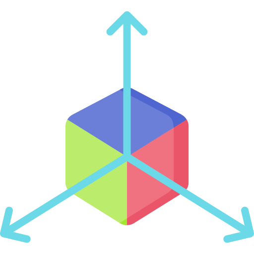

    

<h1 align="center">Vectorize</h1>

**Vectorize** is a small and lightweight library to store 2-, 3- and 4-dimensional vectors
in integer, float and double precision. It offers basic vector operations such as
addition, subtraction, multiplication and division, amongst other utility functions.

## Types

Vectorize offers the following types:

- `Int2`, `Int3`, `Int4`: 2-, 3- and 4-dimensional integer vectors
- `Float2`, `Float3`, `Float4`: 2-, 3- and 4-dimensional float vectors
- `Double2`, `Double3`, `Double4`: 2-, 3- and 4-dimensional double vectors

## Utilities

The following utility methods are available:

- `Vector<T>.add(Vector<T> other)`: Adds two vectors of the same type
- `Vector<T>.subtract(Vector<T> other)`: Subtracts two vectors of the same type
- `Vector<T>.multiply(Vector<T> other)`: Multiplies two vectors of the same type
- `Vector<T>.divide(Vector<T> other)`: Divides two vectors of the same type
- `Vector<T>.pow(Vector<T> power)`: Raises two vectors of the same type to the power of each other
- `Vector<T>.add(T scalar)`: Adds a scalar to a vector
- `Vector<T>.subtract(T scalar)`: Subtracts a scalar from a vector
- `Vector<T>.multiply(T scalar)`: Multiplies a vector by a scalar
- `Vector<T>.divide(T scalar)`: Divides a vector by a scalar
- `Vector<T>.pow(T power)`: Raises a vector to the power of a scalar
- `Vector<T>.negate()`: Negates a vector
- `Vector<T>.abs()`: Returns the absolute value of a vector
- `Vector<T>.normalize(Vector<T> other)`: Returns the normalized vector of a vector
- `Vector<T>.dot(Vector<T> other)`: Returns the dot product of two vectors
- `Vector<T>.angle(Vector<T> other)`: Returns the angle between two vectors
- `Vector<T>.length()`: Returns the length of a vector
- `Vector<T>.lengthSquared()`: Returns the squared length of a vector
- `Vector<T>.distance(Vector<T> other)`: Returns the distance between two vectors
- `Vector<T>.distanceSquared(Vector<T> other)`: Returns the squared distance between two vectors

Conversion methods are available to convert between different vector types and arrays.
Furthermore, 2-, and 3- vectors allow for special operations.

### 2D Vectors

2D vectors allow for the following special operations:

- `Vector2<T>.rotate(Vector2<T> other)`: Rotates a vector by another vector

### 3D Vectors

3D vectors allow for the following special operations:

- `Vector3<T>.cross(Vector3<T> other)`: Returns the cross product of two vectors
- `Vector3<T>.rotateX(Vector3<T> other)`: Rotates a vector by another vector around the X axis
- `Vector3<T>.rotateY(Vector3<T> other)`: Rotates a vector by another vector around the Y axis
- `Vector3<T>.rotateZ(Vector3<T> other)`: Rotates a vector by another vector around the Z axis
